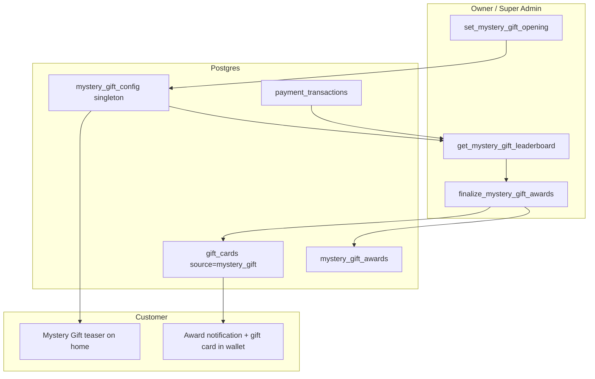

# Mystery Gift — Implementation Plan

## Recommendation summary

Build this as a **dedicated campaign module** (not a generic promotion), because it needs custom spend math, ranked awards, promotional gift-card issuance with **30-day expiry**, and owner-only controls. Reuse existing gift-card infrastructure (`gift_cards`, `gift_card_transactions`, notifications) but add a new issuance path — today [`purchase_gift_card`](sql/087_gift_card_expiration.sql) only supports paid sales with 1-year expiry and cashier-only access.

**Confirmed rules (from you):**

| Rank | Winners | Gift card value |
|------|---------|-----------------|
| 1–3 | 3 | $200 |
| 4–6 | 3 | $100 |
| 7–12 | 6 | $50 |

- **12 winners total** — budget $1,200 in promotional gift cards
- **Teaser only** for customers during the window (no ranks/spend shown)
- **Opening date** set by **owner or super_admin only** (not partner/admin)

---

## Spend definition (authoritative)

Count only **service money actually paid** during the 30-day window `[opening_started_at, opening_started_at + 30 days)`:

```sql
-- Per completed visit payment (payment_transactions.status = 'completed')
GREATEST(
  COALESCE(amount, 0) - COALESCE(discount_amount, 0)   -- service due after all discounts (incl. loyalty)
  - CASE
      WHEN gift_card_id IS NOT NULL
       AND EXISTS (
         SELECT 1 FROM gift_cards gc
         WHERE gc.id = gift_card_id AND gc.source = 'mystery_gift'
       )
      THEN COALESCE(gift_card_amount, 0)   -- don't count promotional credit as spend
      ELSE 0
    END,
  0
)
```

| Included | Excluded |
|----------|----------|
| Cash / card portion of services | Tips (`extras_amount`) |
| Gift card tender at checkout (normal cards) | Loyalty/vault discounts (already netted in `amount - discount_amount`) |
| Mixed tender visits | Redemptions of Mystery Gift cards (via `source` flag) |

**Not included by default:** standalone gift-card purchases (`gift_card_purchases`). Those are a different flow from visit checkout. Recommend visit spend only unless you want purchases to count too.

This aligns with how loyalty already computes service due in [`process_checkout`](sql/114_loyalty_points_service_only.sql) (`v_service_due := amount - discount`), but explicitly strips tips and mystery-gift redemptions.

---

## Architecture



---

## Database changes — new migration [`sql/119_mystery_gift.sql`](sql/119_mystery_gift.sql)

> **Note:** `sql/119_birthday_demo_setup.sql` already exists in the repo. Use the next available migration number (e.g. `120_mystery_gift.sql`) when implementing.

### 1. Extend `gift_cards`

```sql
ALTER TABLE gift_cards
  ADD COLUMN IF NOT EXISTS source text NOT NULL DEFAULT 'purchase'
    CHECK (source IN ('purchase', 'mystery_gift'));
```

Existing cards default to `'purchase'`. Mystery Gift cards get `source = 'mystery_gift'` and `expires_at = now() + interval '30 days'`.

### 2. Campaign config (singleton)

```sql
CREATE TABLE mystery_gift_config (
  id smallint PRIMARY KEY DEFAULT 1 CHECK (id = 1),
  opening_started_at timestamptz NULL,      -- set by owner/super_admin
  awards_finalized_at timestamptz NULL,     -- set when cards issued
  finalized_by_id uuid REFERENCES profiles(id),
  updated_at timestamptz NOT NULL DEFAULT now()
);
```

### 3. Awards ledger (audit + idempotency)

```sql
CREATE TABLE mystery_gift_awards (
  id uuid PRIMARY KEY DEFAULT gen_random_uuid(),
  customer_id uuid NOT NULL REFERENCES profiles(id),
  rank integer NOT NULL CHECK (rank BETWEEN 1 AND 12),
  award_amount numeric(10,2) NOT NULL,
  gift_card_id uuid NOT NULL REFERENCES gift_cards(id),
  created_at timestamptz NOT NULL DEFAULT now(),
  UNIQUE (customer_id),   -- one award per customer per campaign
  UNIQUE (rank)
);
```

### 4. Core SQL functions

| Function | Access | Purpose |
|----------|--------|---------|
| `mystery_gift_is_management_role(role)` | internal | `role IN ('owner', 'super_admin')` |
| `mystery_gift_counted_spend(customer_id, start, end)` | internal | Spend formula above |
| `set_mystery_gift_opening(caller_phone, p_opening_at)` | owner/super_admin | One-time (or guarded) set of opening date |
| `get_mystery_gift_status()` | public | Returns `{ active, days_remaining, opening_at, tracking_ends_at, finalized }` for teaser UI |
| `get_mystery_gift_leaderboard(caller_phone)` | owner/super_admin | Top 12 preview with spend + projected tier |
| `issue_mystery_gift_card(customer_id, amount, rank)` | internal | Insert card with 30-day expiry, no purchase record |
| `finalize_mystery_gift_awards(caller_phone)` | owner/super_admin | Rank customers, issue 12 cards, write awards, send notifications; **idempotent** (no-op if already finalized) |

**Finalize guardrails:**

- Require `now() >= opening_started_at + interval '30 days'` (or allow owner override with explicit `p_force` flag — recommend strict guard)
- Tie-breaker for equal spend: earliest qualifying payment in window, then `customer_id`
- Skip customers with `role != 'customer'` if any staff test checkouts exist
- Send in-app notification per winner (same pattern as gift-card purchase notifications in [`purchase_gift_card`](sql/087_gift_card_expiration.sql))

**Award tier mapping in SQL:**

```sql
award_amount := CASE
  WHEN rank <= 3 THEN 200
  WHEN rank <= 6 THEN 100
  ELSE 50
END;
```

---

## Shared package — [`packages/shared`](packages/shared)

| File | Changes |
|------|---------|
| [`constants/featureFlags.js`](packages/shared/src/constants/featureFlags.js) | `customer.mysteryGift: true`, `staff.mysteryGiftAdmin: true` |
| New `utils/mysteryGift.js` | RPC wrappers: `setMysteryGiftOpening`, `getMysteryGiftStatus`, `getMysteryGiftLeaderboard`, `finalizeMysteryGiftAwards` |
| New `hooks/useMysteryGift.js` | Customer teaser hook (reads status); admin hook (leaderboard + actions) |

---

## Admin UI — owner / super_admin only

Add a **Mystery Gift** section to [`apps/web/src/components/Settings.jsx`](apps/web/src/components/Settings.jsx) (gated `role === 'owner' || role === 'super_admin'`, mirroring super-admin-only panels already in that file):

- **Before opening:** date/time picker + "Start Mystery Gift tracking" confirm dialog
- **During window:** countdown, read-only status, **leaderboard preview table** (admin eyes only)
- **After day 30:** "Finalize & issue gift cards" button (shows projected 12 winners first)
- **After finalized:** summary of issued awards + links to customer profiles

Mirror a lighter version in mobile staff settings if owners use the app (`apps/mobile`).

---

## Customer teaser UI

During `get_mystery_gift_status().active === true` and not yet finalized:

- **Web:** small banner/card on customer home (alongside existing promotions in [`usePromotions`](packages/shared/src/hooks/usePromotions.js) surfaces — separate component, not a `promotions` row, so it doesn't compete with the 2-active-promo limit in [`sql/082_promotion_active_audience_limit.sql`](sql/082_promotion_active_audience_limit.sql))
- **Mobile:** matching teaser on customer home screen
- Copy example: *"Grand Opening Mystery Gift — visit us in our first 30 days for a chance at an exclusive gift card. Top spenders will be surprised!"*
- **No rank, no spend amount, no leaderboard**

After finalize, winners get a normal gift-card notification; non-winners see nothing extra.

---

## Why not reuse existing systems as-is?

| Existing piece | Gap |
|----------------|-----|
| [`promotions`](sql/075_promotions.sql) table | No ranked spend logic or gift-card issuance |
| [`purchase_gift_card`](sql/087_gift_card_expiration.sql) | Requires payment, cashier role, $10–$500 sale flow, 1-year expiry |
| [`profiles.rolling_spend_12m`](sql/104_rolling_loyalty_tiers.sql) | 365-day window, includes tips, wrong period |
| Customer `totalSpent` in UI | Uses `final_amount` only — wrong for this feature |

---

## Testing checklist

1. Set opening date → status returns `active`, teaser appears for customers
2. Checkout with cash, card, mixed, normal gift card → spend increases correctly
3. Checkout with tips → tips do not increase counted spend
4. Loyalty discount checkout → only net service amount counts
5. Redeem a mystery gift card after award → redemption does not inflate spend
6. Leaderboard ranks 12 customers with correct tier amounts
7. Finalize before day 30 → blocked
8. Finalize after day 30 → 12 cards issued, 30-day expiry, notifications sent
9. Second finalize call → idempotent, no duplicate cards
10. Partner/admin cannot set opening or finalize

---

## Optional phase-2 enhancements (out of scope unless you want them)

- Supabase `pg_cron` job to auto-finalize at `opening + 30 days` (codebase has no cron today; birthday wishes use manual/external trigger)
- Include `gift_card_purchases` in spend
- Partner read-only leaderboard access
- Customer push/SMS in addition to in-app notification
